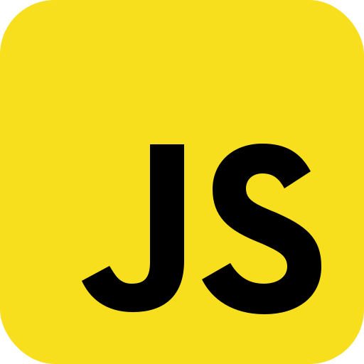

#setup

<b>before editing anythings in dist</b>

Stop:1: Watch dist folder all the code has been given there

Stop:2: Go to script.js and go to line number: 14

Stop:3: I hope you found that

Stop:4: Now write the time when you want to start the event 

Stop:5: Save and go to browser and check 

Note: please change class name carefully (if you want to change)

<b>If it's not working then please let me know in my social account below</b>

#Social media account
 github account  
 Linkedin  

#technologies
 Html
 CSS
 JavaScript
 Bootstrap
